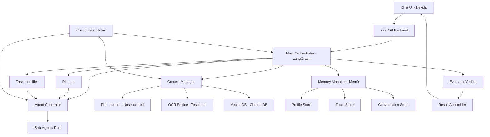
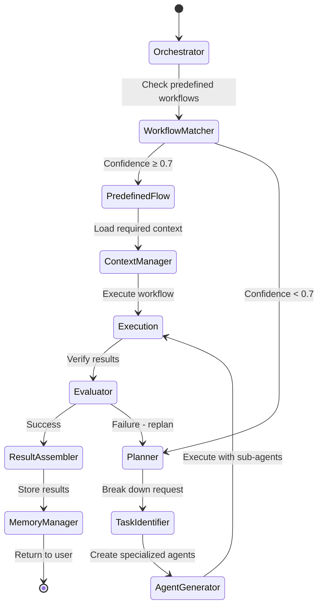

# Design Document

## Overview

Local Agent Studio (LAS) is architected as a modular, graph-based multi-agent system built on LangGraph for precise control over agent workflows and state management. The system employs a hybrid execution model where a Main Orchestrator intelligently routes between predefined workflows and dynamic agent generation based on request complexity and confidence matching.

The architecture follows a microservices pattern with clear separation of concerns: orchestration, planning, agent generation, context management, memory, and evaluation. All components communicate through well-defined interfaces and operate within configurable resource constraints to ensure predictable behavior and prevent runaway execution.

## Architecture

### High-Level System Architecture



### Execution Flow Architecture



## Components and Interfaces

### Main Orchestrator

**Purpose:** Central coordination hub that manages workflow selection, resource allocation, and execution oversight.

**Key Responsibilities:**
- Route requests between predefined workflows and planner-driven execution
- Enforce global constraints (max iterations, token budgets, timeouts)
- Coordinate between all system components
- Maintain execution state and progress tracking

**Interface:**
```python
class MainOrchestrator:
    def process_request(self, user_input: str, context: Dict) -> ExecutionResult
    def select_execution_path(self, request: str) -> ExecutionPath
    def enforce_limits(self, execution_state: ExecutionState) -> bool
    def coordinate_components(self, task_graph: TaskGraph) -> None
```

**Configuration:**
- Maximum iterations per execution (default: 6)
- Token budget limits
- Workflow confidence threshold (default: 0.7)
- Fallback behavior settings

### Planner

**Purpose:** Decomposes complex requests into structured task graphs with dependencies and success criteria.

**Key Responsibilities:**
- Analyze user requests for complexity and requirements
- Generate minimal task sets with clear dependencies
- Define success criteria for each task
- Optimize task ordering for efficiency

**Interface:**
```python
class Planner:
    def decompose_request(self, request: str, context: Dict) -> TaskGraph
    def identify_dependencies(self, tasks: List[Task]) -> DependencyGraph
    def set_success_criteria(self, task: Task) -> SuccessCriteria
```

**Output Schema:**
```json
{
  "tasks": [
    {
      "name": "string",
      "inputs": ["string"],
      "expected_output": "string",
      "success_criteria": ["string"],
      "dependencies": ["task_id"]
    }
  ],
  "execution_order": ["task_id"],
  "global_success_criteria": ["string"]
}
```

### Agent Generator

**Purpose:** Creates specialized sub-agents with tailored prompts, tools, and constraints for specific tasks.

**Key Responsibilities:**
- Generate context-specific system prompts
- Select appropriate tools for each agent
- Set execution limits and stop conditions
- Create agent specifications for instantiation

**Interface:**
```python
class AgentGenerator:
    def create_agent_spec(self, task: Task, context: Dict) -> AgentSpec
    def generate_system_prompt(self, task: Task) -> str
    def select_tools(self, task_type: str) -> List[Tool]
    def set_agent_limits(self, complexity: int) -> AgentLimits
```

**Agent Template:**
```yaml
agent_template:
  system_prompt: |
    You are a specialized agent for task: {task_name}
    Goal: {goal}
    Available tools: {tools}
    Hard limits: {limits}
    Required outputs: {outputs}
    Stop conditions: {stop_conditions}
  limits:
    max_steps: 4
    max_tokens: 2000
    allowed_tools: []
  output_contract:
    format: "json|text|structured"
    required_fields: []
```

### Context Manager

**Purpose:** Handles file ingestion, processing, chunking, embedding, and retrieval operations.

**Key Responsibilities:**
- Process multiple file formats (Office, PDF, images)
- Perform OCR on image-based content
- Generate semantic chunks with appropriate overlap
- Manage vector embeddings and retrieval
- Route tool requests to appropriate handlers

**Interface:**
```python
class ContextManager:
    def ingest_file(self, file_path: str) -> ProcessingResult
    def chunk_content(self, content: str) -> List[Chunk]
    def generate_embeddings(self, chunks: List[Chunk]) -> List[Embedding]
    def retrieve_context(self, query: str, k: int = 10) -> List[Chunk]
    def route_tool_request(self, tool_name: str, params: Dict) -> ToolResult
```

**Processing Pipeline:**
1. File type detection and loader selection
2. Content extraction (with OCR fallback for images)
3. Content normalization and cleaning
4. Semantic chunking (800-1200 tokens, 80-150 overlap)
5. Embedding generation via OpenAI API
6. Vector storage in ChromaDB/LanceDB

### Memory Manager

**Purpose:** Maintains persistent, cross-session memory including profiles, facts, conversations, and summaries.

**Key Responsibilities:**
- Store and retrieve user profiles and preferences
- Manage factual knowledge with timestamps and sources
- Maintain conversation history with topic summaries
- Track RAG retrieval patterns for optimization
- Apply memory policies (TTL, size limits)

**Interface:**
```python
class MemoryManager:
    def store_profile(self, user_id: str, profile: UserProfile) -> None
    def add_fact(self, fact: str, source: str, timestamp: datetime) -> None
    def update_conversation(self, session_id: str, messages: List[Message]) -> None
    def retrieve_relevant_memory(self, context: str) -> MemoryContext
    def apply_retention_policies(self) -> None
```

**Memory Schema:**
```json
{
  "profile": {
    "name": "string",
    "preferences": {},
    "communication_style": "string"
  },
  "facts": [
    {
      "content": "string",
      "source": "string",
      "timestamp": "datetime",
      "confidence": "float"
    }
  ],
  "conversations": [
    {
      "session_id": "string",
      "summary": "string",
      "key_topics": ["string"],
      "timestamp": "datetime"
    }
  ]
}
```

### Evaluator/Verifier

**Purpose:** Validates outputs against success criteria, checks source grounding, and identifies contradictions.

**Key Responsibilities:**
- Verify task completion against defined criteria
- Check answer grounding in retrieved sources
- Detect logical contradictions or inconsistencies
- Trigger replanning when verification fails
- Generate quality scores and confidence metrics

**Interface:**
```python
class Evaluator:
    def verify_task_completion(self, task: Task, output: Any) -> VerificationResult
    def check_source_grounding(self, answer: str, sources: List[Chunk]) -> bool
    def detect_contradictions(self, statements: List[str]) -> List[Contradiction]
    def generate_quality_score(self, output: Any, criteria: List[str]) -> float
```

## Data Models

### Core Entities

```python
@dataclass
class Task:
    id: str
    name: str
    description: str
    inputs: List[str]
    expected_output: str
    success_criteria: List[str]
    dependencies: List[str]
    assigned_agent: Optional[str] = None
    status: TaskStatus = TaskStatus.PENDING

@dataclass
class AgentSpec:
    id: str
    system_prompt: str
    tools: List[str]
    limits: AgentLimits
    output_contract: OutputContract
    created_for_task: str

@dataclass
class ExecutionState:
    session_id: str
    current_step: int
    max_steps: int
    tokens_used: int
    token_budget: int
    active_agents: List[str]
    completed_tasks: List[str]
    execution_path: ExecutionPath

@dataclass
class Chunk:
    id: str
    content: str
    source_file: str
    page_number: Optional[int]
    embedding: Optional[List[float]]
    metadata: Dict[str, Any]
```

### Configuration Models

```python
@dataclass
class SystemConfig:
    orchestrator: OrchestratorConfig
    planner: PlannerConfig
    agent_generator: AgentGeneratorConfig
    context_manager: ContextConfig
    memory: MemoryConfig
    workflows: Dict[str, WorkflowConfig]

@dataclass
class WorkflowConfig:
    name: str
    description: str
    steps: List[str]
    triggers: List[str]
    success_criteria: List[str]
```

## Error Handling

### Error Categories and Strategies

**File Processing Errors:**
- Unsupported file formats → Fallback to alternative loaders
- OCR failures → Log error, attempt with different OCR engine
- Corrupted files → Skip with user notification

**Agent Execution Errors:**
- Resource limit exceeded → Graceful termination with partial results
- Tool failures → Retry with alternative tools or manual fallback
- Infinite loops → Circuit breaker with step counting

**Memory and Storage Errors:**
- Vector DB connection issues → Fallback to in-memory search
- Memory capacity exceeded → Apply retention policies automatically
- Embedding API failures → Cache and retry with exponential backoff

**System-Level Errors:**
- Configuration errors → Load defaults and log warnings
- Network connectivity issues → Continue with cached data
- Resource exhaustion → Queue requests and process when resources available

### Error Recovery Mechanisms

```python
class ErrorHandler:
    def handle_file_processing_error(self, error: FileProcessingError) -> RecoveryAction
    def handle_agent_execution_error(self, error: AgentExecutionError) -> RecoveryAction
    def handle_memory_error(self, error: MemoryError) -> RecoveryAction
    def handle_system_error(self, error: SystemError) -> RecoveryAction
```

## Testing Strategy

### Unit Testing

**Component-Level Tests:**
- Orchestrator routing logic with mock workflows
- Planner task decomposition with various request types
- Agent Generator prompt generation and tool selection
- Context Manager file processing and chunking
- Memory Manager storage and retrieval operations
- Evaluator verification logic with known good/bad outputs

**Test Coverage Targets:**
- Core logic: 90%+ coverage
- Error handling: 80%+ coverage
- Configuration loading: 95%+ coverage

### Integration Testing

**End-to-End Workflows:**
- Complete RAG pipeline: upload → process → query → answer
- Dynamic agent creation and execution
- Memory persistence across sessions
- Multi-file processing and cross-document queries

**Performance Testing:**
- File processing throughput (various sizes and types)
- Concurrent agent execution limits
- Memory usage under load
- Response time benchmarks

### Acceptance Testing

**User Scenarios:**
- Upload Office documents and ask questions with citations
- Process image-based PDFs with OCR
- Execute complex multi-step requests requiring agent spawning
- Verify memory persistence and personalization
- Test configuration changes without system restart

**Quality Metrics:**
- Answer accuracy against ground truth
- Citation precision and recall
- Response time within acceptable limits
- Memory efficiency and cleanup

### Testing Infrastructure

```python
class TestFramework:
    def setup_test_environment(self) -> TestEnvironment
    def create_mock_agents(self) -> List[MockAgent]
    def generate_test_documents(self) -> List[TestDocument]
    def validate_system_behavior(self, scenario: TestScenario) -> TestResult
```

**Test Data Management:**
- Synthetic document generation for various formats
- Mock OpenAI API responses for consistent testing
- Test configuration profiles for different scenarios
- Automated test data cleanup and reset